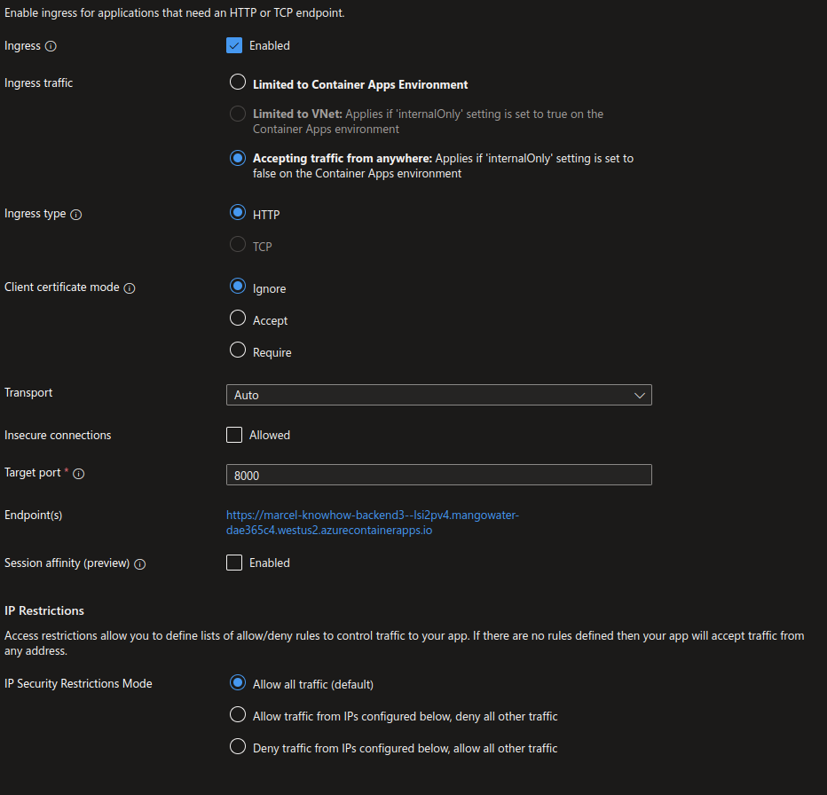

 ```
 __  __                    _   ____             _                  _ 
|  \/  | __ _ _ __ ___ ___| | | __ )  __ _  ___| | _____ _ __   __| |
| |\/| |/ _` | '__/ __/ _ \ | |  _ \ / _` |/ __| |/ / _ \ '_ \ / _` |
| |  | | (_| | | | (_|  __/ | | |_) | (_| | (__|   <  __/ | | | (_| |
|_|  |_|\__,_|_|  \___\___|_| |____/ \__,_|\___|_|\_\___|_| |_|\__,_|
                                                                     
```
Marcel Know How Backend Project
===============================
This projects holds the backend functionality for Marcel's know how session.
The backend provides an API to query general knowledge questions to be used in a quiz game.


# Local Development Environment

## Using Visual Studio Code
Inside VSC hit Ctrl+Shift+P and search for `python: create environment`.
Select `.venv`, a Python executable with Python 3.10 or higher and choose to install the dependencies from the requirements.txt file.
You should be able to run and debug the Fast API server by hitting F5 on the main.py file.

## Without Visual Studio Code
It is recommened to create a virtual environment with Python 3.10 or higher.
Given you have Python installed run run the following command in the project's root:
```bash
python3 -m venv .venv
```
Activate the virtual environment with:
```bash
source .venv/bin/activate
```
Install the dependencies with:
```bash
pip install -r requirements.txt
```

# Shipping
## Local Docker Environment
Local Docker image build:
```bash
docker buildx build -t marcel_knowhow_backend .
```

Use the docker compose file with `docker-compose up -d` to start the backend.
Browse locally to http://localhost:8080/ to see the backend running.

## Image for Azure Container Registry and Azure Container Apps Service
Build the docker image with:
```bash
docker buildx build \
	--platform linux/amd64 \
	-t jnicontainerregistry.azurecr.io/marcel_knowhow_backend \
	.
```

Push manually build image to registry
Use `docker push jnicontainerregistry.azurecr.io/marcel_knowhow_backend:latest` to push the image to the registry.


## Continuous Integration and Deployment with GitHub Actions
The project comes with a GitHub Actions workflow to build and push the image to the Azure Container Registry (see `./.github/workflows/backend.yaml`).

To use push a new image to the Azure Container Registry set the three secrets in Github:
- REGISTRY_LOGIN_SERVER
- REGISTRY_USERNAME
- REGISTRY_PASSWORD


# Azure Container Apps Service
- Set the Container app name to `marcel-knowhow-backend`.
- Choose the latest backend image from the AZR.
- Select **0.75 vCPU, 1.5 GB RAM** for CPU and Memory.
- Provide an environment variable `MARCEL_DB_URI` to point to the database app `bolt://marcel-knowhow-db:7687`.
- Enable Ingress
- Accept trafffic from anywhere
- Set the Target port to `8000`
- After deployment set CORS wildcards for everything to for frontend access from different origin.


